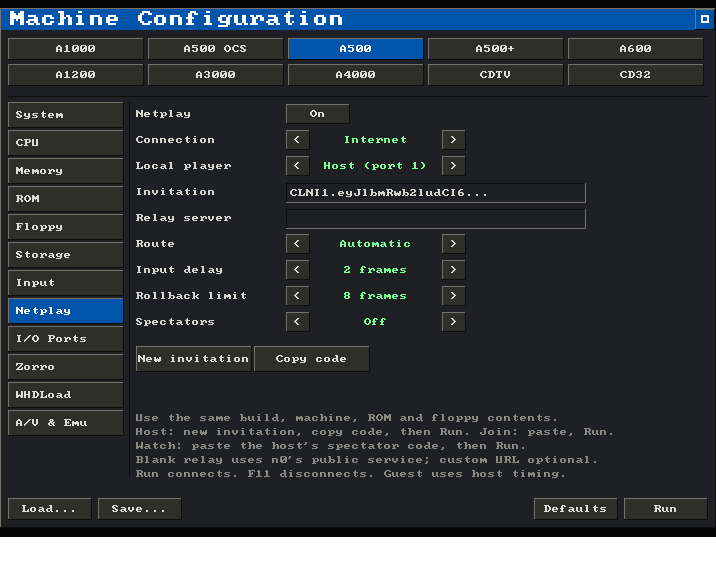

# Rollback netplay

Copperline can run a two-player game across two desktop instances or two browsers.
Each peer emulates the whole Amiga and owns one controller port. Both players
see their own input after a small configurable delay. Copperline predicts late
remote input, then restores and replays frames when that prediction was wrong.
This follows the approach described by [GGPO](https://github.com/pond3r/ggpo);
it uses Copperline's own Rust implementation and wire protocol.

Desktop builds offer direct UDP connections by IP address or encrypted Internet
connections with automatic NAT traversal and relay fallback. Browsers use WebRTC
with private room invitations and TURN relay fallback when the page has a room
service configured. Browser manual connection codes remain available.
The host can admit up to eight spectators, who watch the game without playing
and may join while it is in progress (see [Spectators](#netplay-spectators)).
There is no public lobby or automatic reconnect. Browser and desktop peers
cannot connect to each other. Use the same Copperline build on every machine;
mixed operating systems and browser engines have not yet been qualified.

(browser-netplay)=
## Set up in the browser

On the [browser page](browser.md), open **Controls → Netplay**. The host loads
the ROM and disks and chooses the machine settings. The guest receives that
setup automatically over the encrypted peer connection. Both pages need the
same emulator build. Connecting starts a fresh machine, replacing any running
local session: the guest's page is locked from **Join game** on, while the
host keeps playing, changing disks or adjusting the machine until player 2
arrives, and shares whatever it holds at that moment.

1. The host clicks **Host game** and shares the invitation link using **Copy
   invitation**, the device share sheet, or the QR code. **Advanced** contains
   the controller type, input delay and rollback limit.
2. The other player opens the link (or pastes it into the invitation field),
   then clicks **Join game**. The offer and answer are exchanged automatically.
   A progress message tracks the transfer of ROMs, both inserted floppy images
   and machine settings. The host also supplies the controller and delay settings.
3. The guest verifies every file before both pages cold-boot and check their initial machines. The
   panel reports confirmed frames, rollbacks and the latest checked frame.

Invitations allow one joining player and expire after 15 minutes. Expiry removes
setup data from the service; it does not stop an established game. Share links
privately: anyone with a live invitation can claim its remaining place. The link
contains an opaque room ID, with no ROM URLs, connection codes or credentials.

Host owns Amiga port 1; Join owns port 2. On each page, the usual first gamepad,
keyboard joystick or touch controls drive that player's port. The keyboard
joystick mode is enabled on desktop browsers; touch devices start with touch
controls. Cycle **Joystick** off to type ordinary Amiga keys. Both keyboards
contribute to the shared keyboard. The desktop F11/F12 netplay shortcuts do not
apply to the browser.

For games that use two mice, such as two-player Lemmings, the host chooses
**Advanced → Controllers → Two mice** before hosting. Each player's mouse then
drives their own Amiga port, including left, right and middle mouse buttons.
Touch devices can use the canvas trackpad for movement and left/right clicks.
Click the screen to capture the mouse; Escape releases it. Keyboard joystick mode stays off so both players can type ordinary Amiga keys.

Room setup uses a small signaling service. WebRTC tries direct routes and can
fall back to a TURN relay. **Advanced → Use relay only** forces that route for
troubleshooting. Relay credentials expire after 24 hours; start a new session
for longer play. WebRTC encrypts game files and input packets, including traffic
carried by a relay. The signaling service receives no ROM or disk bytes.

Received files are held only for the session and are not saved into the guest's
remembered-ROM storage. Disconnect restores the guest's previous media choices
and settings. The host shares the main and extended ROMs, DF0/DF1 images and their
write-protection flags, model, video standard, floppy speed, drive sounds and
mono/stereo setting. Display preferences and volume stay local. ROMs are limited
to 2 MiB each and floppy images to 16 MiB each. Starting from a running machine
uses the current contents of writable disks; it still cold-boots rather than
transferring a running save state.

### Changing disks during browser play

When a game asks for another disk, the host opens **Controls → Netplay**, selects
**DF0** (or DF1) under **Drive**, and chooses the next image under **Swap disk**.
Both machines pause, the guest receives and verifies the replacement, and both
resume at the same emulated frame. The guest does not need to select a file.
This works with games that require all disks in DF0. **Eject selected drive**
performs a synchronized removal if a game needs to see an empty drive first;
choose the next disk when ready. The ordinary local disk controls remain locked.

Replacement images are limited to 16 MiB, including after gzip/zip expansion,
and default to write-protected. The controls become available once the disk
transfer channel is connected.
**Allow writes to the replacement disk** supports uncompressed standard and UAE
extended ADFs. Writable changes are held only in the mounted session image;
replacing that disk or disconnecting discards them. Invalid local files leave
the game running. An interrupted transfer or a state mismatch ends the session
rather than allowing the players to continue with different disks.

### Watching a browser game

Every game hosted through **Host game** admits up to eight spectators;
manual connection codes have no room service and so no spectators. Besides
the player invitation, the panel shows a **Spectator invitation** with its own
copy and share buttons and QR code; once player 2 has joined, the spent
player invitation gives way and only the spectator invitation stays on show. It is a
different link: it cannot claim the player 2 place, and the player invitation
cannot be used to watch, so the page offers **Watch game** for a spectator
link and **Join game** for a player invitation, never both. A spectator who
finds every place taken is told so instead of waiting. Spectators open the
link and click **Watch game**. They receive the
host's ROMs, disks and machine settings exactly like player 2, cold-boot the
same machine, and then replay the game from its first frame until they are
level with the players, so a spectator can join at any point while the game
lasts. Catching up runs unpaced and silent; a long game takes a while to
replay. The panel reports the spectator's frame, how far behind it is and the
last checked frame; the host's status line counts who is watching.

Spectators send no input and cannot change disks: their machine follows the
host's confirmed timeline only, a few frames behind the players, and every
checkpoint the players verify is verified again on the spectator. When the
host changes a disk, spectators receive the same image and apply it at the
same frame. A spectator's page has the same locked controls as a guest;
**Disconnect** stops watching without affecting the players, and a spectator
that stalls or diverges is dropped by the host on its own. The spectator
invitation stays valid while the host is playing and expires 15 minutes after
the host stops.

If a connection ends, use **Copy diagnostics** on both devices. The report keeps
ICE, peer, data-channel and DTLS states, candidate types and packet counters.
It excludes network addresses, SDP, invitation/session tokens and credentials.
A route that opens before DTLS fails needs different investigation from failed
ICE discovery. Browser versions alone do not establish the cause.

**Advanced → Manual connection codes** works without the room service. The host
clicks **Host with manual codes**, sends its code to the guest, and the guest
pastes it and clicks **Join offer**. The guest sends its answer back; the host
pastes it and clicks **Connect answer**. The STUN field helps discover routes;
leave it blank for LAN-only discovery. Manual setup has no relay fallback.
Current pages transfer host files and settings after manual signaling too.
Its large codes contain network addresses and session details, so exchange them
privately. If the page has no room service configured, Advanced opens by default.

Keep both pages open. A suspended tab can stall its peer and eventually time out;
background execution depends on browser and device restrictions. Machine, media,
serial, floppy sound, pause and save-state controls are locked from the moment
the page captures its media (**Join game** or **Watch game** for a guest or
spectator, player 2's arrival for the host) until disconnect.
Display and main output volume choices remain local. Floppy sound enablement
and level are part of the machine fingerprint and must match. **Disconnect** cancels setup or stops
play, discards session disk writes, and restores the selected cold-boot media.
Either player can host or join again with a new invitation or new manual codes. The browser does not resume
the abandoned network timeline as local play.

## Set up in the GUI

Open **Machine Configuration → Netplay** (or start Copperline with no arguments).
The host chooses the machine, ROM and game media on the existing configuration
pages, including WHDLoad or supported hard-drive images. Enable **Netplay** on
both computers. The guest receives the host's setup and needs no local copy of
the game files.

IPF disks work with both desktop connection methods. Setup preserves their
raw tracks and protection-track timing, including all 168 track slots. They
remain write-protected, just as in local play.

### Internet connections

Choose **Connection → Internet** on both computers. This mode uses
[iroh](https://docs.rs/iroh/1.1.0/iroh/) to establish an encrypted connection and
find a direct route through NAT. If a direct route is unavailable, packets travel
through an HTTPS relay. No port forwarding is normally needed.



1. The host chooses **Host (port 1)**, sets **Input delay** and **Rollback limit**,
   then clicks **New invitation** and **Copy code**. Send that code privately to
   the other player, then click **Run**.
2. The guest chooses **Join (port 2)**, pastes the code into **Invitation**, and
   clicks **Run**. The invitation supplies the host's timing and relay settings.
   The host then transfers the machine settings, ROMs and game media. The guest's
   saved configuration and original files remain unchanged.
3. The cold machine waits for the peer before running. The connection message
   reports the route; the log records changes between direct and relay paths.
   **F11** cancels setup or disconnects play. Setup times out after 15 minutes.

Leave **Relay server** blank to use n0's public iroh relays. These are external services,
with rate limits and availability controlled by their operator; n0 describes them
as suitable for development and testing. For sustained use, the host can enter
the HTTPS URL of a [self-hosted iroh relay](https://github.com/n0-computer/iroh/tree/main/iroh-relay).
This field takes an iroh relay, not a STUN/TURN server. The invitation carries its
relay addresses, so the guest needs no separate server setup. Address lookup
services are not used. See [iroh's relay guidance](https://docs.iroh.computer/about/faq).

**Route → Relay only** disables direct IP paths for troubleshooting or when you
prefer to keep peer traffic on the relay. Relay operators can observe connection
metadata and traffic volume, but the payload is encrypted end to end. Share the
invitation privately: it identifies the host and authorizes one guest. Host keys
stay in memory and are never included in invitations or saved configurations.
Generate a new invitation for a new game, or after changing host timing or relay
settings. A relay outage can prevent connection; **Direct IP** remains available
for reachable peers. Networks that also block the relay's HTTPS connection may
still require a permitted network path.

Internet support is included in default native builds by the `netplay-internet`
Cargo feature. Browser and desktop invitation formats are separate.

### Direct IP connections

Choose **Connection → Direct IP (UDP)** on both computers.


1. Choose **Player 1** on one computer and **Player 2** on the other.
2. Leave **Local address** at `0.0.0.0:19732` to listen on all local IPv4
   interfaces. Set **Peer address** to the other computer's reachable IP and
   port, for example `192.168.1.11:19732`. For IPv6, use bracketed addresses
   such as `[::]:19732` and `[2001:db8::2]:19732` on both peers.
3. One player clicks **New code**, then **Copy code**, and shares it with the
   other player. The other player pastes that code into **Session code**.
   Cmd+V on macOS or Ctrl+V elsewhere replaces the focused address/code box;
   Return commits an edit and Escape cancels it.
4. Player 1 chooses **Input delay** and **Rollback limit**. Click **Run** on
   both computers. Player 1 sends the setup and files to player 2; both windows
   wait for verification before emulation begins.

Enabling netplay changes analogue, gamepad-mouse and empty ports to joysticks, turns serial
and JIT off, disables run-ahead and warp boot, and enables power on. Existing
mouse/joystick/CD32 ports stay selected. These changes are visible on the other
configuration pages; Run reapplies them after model or configuration changes.
The host chooses ROMs, media, storage and controller devices; Run explains any
incompatible setting. For a two-mouse game, the host selects **Mouse** on both
ports; for a two-joystick game, **Joystick** on both ports. Joining temporarily
replaces the guest's machine while retaining its saved configuration choices.

**F11** disconnects and returns to the Netplay page with the connection details
intact. A connection failure also returns there, showing its error. Correct the
settings and press Run on both peers to start again from cold boot. The peer
addresses, session code, player and delay/window settings are kept for the current
app session; Save does not put them in machine configuration files.

The GUI and CLI can connect to each other when both select the same transport.
An app started with a control or GDB endpoint must be restarted without that
endpoint before enabling netplay in the GUI.

(netplay-spectators)=
### Spectators

The host's **Spectators** row admits up to eight spectators (Off by default).
A spectator chooses **Local player → Watch** (Internet) or **Spectator**
(Direct IP). In Internet mode the host clicks **New invitation** after setting
the spectator count; **Copy spectator code** then copies a separate `CLNS1.`
code, which the spectator pastes into **Invitation**. A player invitation does
not admit a spectator and a spectator code does not admit a player. In Direct
IP mode the spectator enters the host's address as the peer address, pastes
the players' session code, and connects to the host's existing UDP port; no
extra port is opened.

Spectators can join before the game starts or while it is running. They
receive the host's machine setup and media like a guest, cold-boot the same
machine, and replay the host's confirmed input history from frame zero,
unpaced and silent, until they are within a few frames of the players; the
OSD reports the catch-up. From then on the spectator follows a few frames
behind the players, verifying the same checkpoints and applying the host's
floppy changes at the same frames. Spectators own no controller port: keys,
mice and gamepads never reach the shared machine, the disk controls are
disabled, and only the Quit, Fullscreen and **F11** shortcuts apply. A
spectator leaving or failing never interrupts the players; the host drops a
spectator that stops responding for ten seconds. A game that has been running
for a long time takes correspondingly long to replay, and the host stops
admitting new spectators once it retains more than 256 MiB of history.

## Start from the command line

Give the host the ROM, game files and machine settings. A floppy can come from
the configuration or `--insert-disk-after 0 df0 PATH`. The guest supplies only
connection details. The host can also use `--whdload game.lha`, `--run program`,
directory volumes, or IDE/SCSI/LIDE hard-drive images. Netplay takes a private
copy of these volumes; in-session writes and saves do not update the original
game directory or hardfile.

For Internet play, the host writes an invitation to a file:

```sh
copperline --factory --model A500 --serial off --port1 joystick --port2 joystick \
  --netplay-host invitation.txt --insert-disk-after 0 df0 game.adf KICK13.ROM
```

The guest copies the code from that file and supplies it as one argument:

```sh
copperline --netplay-join 'CLNI1.PASTE_THE_FULL_CODE_HERE'
```

The host may add `--netplay-relay https://relay.example.com` for a custom iroh
relay. Either peer may add `--netplay-relay-only`. The host chooses
`--netplay-delay` and `--netplay-rollback`; the guest inherits them. Internet
flags cannot be combined with direct IP, player or session-ID flags.

To admit spectators, the host adds `--netplay-spectators N` (1 to 8) and, in
Internet mode, `--netplay-spectator-invite PATH` to write the separate
spectator code:

```sh
copperline --factory --model A500 --serial off --port1 joystick --port2 joystick \
  --netplay-host invitation.txt --netplay-spectators 4 \
  --netplay-spectator-invite spectators.txt --insert-disk-after 0 df0 game.adf KICK13.ROM
```

A spectator supplies that code, and nothing else, with `--netplay-watch`:

```sh
copperline --netplay-watch 'CLNS1.PASTE_THE_SPECTATOR_CODE_HERE'
```

`--netplay-relay-only` applies to spectators too. Scripted input, media
changes and the timing flags are rejected for a spectator; scheduled
screenshots work as they do for players.

For direct IP play on a LAN where the players are `192.168.1.10` and `192.168.1.11`:

```sh
# Player 1, on 192.168.1.10:
copperline --factory --model A500 --serial off --port1 joystick --port2 joystick \
  --netplay-bind 0.0.0.0:19732 --netplay-peer 192.168.1.11:19732 \
  --netplay-player 1 --netplay-session 8b21488dae9544f591adf03e291ce976 \
  --insert-disk-after 0 df0 game.adf KICK13.ROM

# Player 2, on 192.168.1.11 (no local ROM or disk required):
copperline \
  --netplay-bind 0.0.0.0:19732 --netplay-peer 192.168.1.10:19732 \
  --netplay-player 2 --netplay-session 8b21488dae9544f591adf03e291ce976
```

A direct IP spectator names the host's endpoint and the players' session ID;
the host adds `--netplay-spectators N`, and spectators share its UDP port:

```sh
# Player 1 admits two spectators on its existing port:
copperline ... --netplay-player 1 --netplay-session 8b21488dae9544f591adf03e291ce976 \
  --netplay-spectators 2 ...

# A spectator, anywhere that can reach player 1:
copperline --netplay-watch 192.168.1.10:19732 \
  --netplay-session 8b21488dae9544f591adf03e291ce976
```

`--netplay-bind` picks the spectator's local endpoint; it defaults to any
address and an ephemeral port.

Use a fresh 32-digit hexadecimal session ID for each game, shared with your
peer; `openssl rand -hex 16` generates one. The example ID is illustrative.
Allow the chosen UDP port through each host's firewall. Across the internet,
both endpoints must be reachable at the addresses given to the other peer,
usually through port forwarding or a private VPN. A VPN also supplies transport
encryption and authentication: the direct UDP transport sends inputs and game files in
cleartext, and its session ID distinguishes games rather than authenticating a
person. Connect only to a trusted peer.

Both windows wait until the transferred setup produces matching initial machine
fingerprints. Different builds or corrupt transfers stop the connection. A
fitted guest clock defaults to 2000-01-01 UTC; the host can choose another
starting time with `--rtc-time`.

### Change desktop floppy disks

The host uses the status bar's load, next-disk and eject buttons for DF0–DF3.
The load picker can select a playlist; Cmd+D on macOS or Alt+D elsewhere cycles
it. Dropping floppy images loads a playlist into the first connected drive.
The guest's media controls are disabled. The host can schedule a replacement
with `--insert-disk-after SECS dfN PATH` at a nonzero emulated time.

Both peers stop at a confirmed frame, verify and transfer the replacement,
apply it together, then resume. A bad local file leaves the current game
running; a failed transfer ends the session. The picker keeps the connection
alive while the host selects files. Disk changes never write received data over
the guest's original files.

Desktop setup allows up to 512 MiB of media in total, with a 256 MiB limit per
hard drive, 16 MiB per floppy (including decompression), and 2 MiB per ROM.
Machine, expansion and video RAM together are limited to 64 MiB, and the
rollback snapshot budget may require a smaller machine or prediction window.
Host filesystem mounts, including WHDLoad and executable boot volumes, become
OFS images, preserving their volume name and boot priority; normal Amiga
filesystem filename limits apply. Directory mounts already on IDE, SCSI or LIDE
keep their configured filesystem. Received ROM and hard-drive files are staged
in a private temporary directory which is removed at disconnect.

## Controls

Player 1 controls Amiga port 1; player 2 controls port 2. For joystick/CD32
ports, a connected gamepad drives the local port. Without a gamepad, the first
keyboard controller mapping drives it: by default arrows move, right Ctrl fires, and
left Alt is the second button. The existing saved input mappings apply.
The desktop host chooses `mouse`, `joystick` or `cd32` for each port; the guest
inherits those choices. A mouse port takes that player's host mouse, with
keyboard typing enabled automatically. For two mice, pass
`--port1 mouse --port2 mouse` on the host. Mixed mouse and joystick/CD32
configurations also work on desktop.

Audio output device selection (including Disabled), display preferences and
host input preferences such as mouse sensitivity remain local to each player.

For joystick/CD32 ports, press **F12** to switch between keyboard controller
mode and typing on the Amiga keyboard. Typing mode sends keys such as Return and the arrows to the guest
instead of consuming them as controller bindings. Keyboard input from the two
peers is combined: a key stays pressed while either player holds it. Losing
window focus releases local held controls on the next sampled frame.

The host Quit and Fullscreen shortcuts remain available (Cmd+Q/Cmd+F on macOS,
Alt+Q/Alt+F elsewhere). Click the display to capture the mouse; Cmd+G on macOS
or Alt+G elsewhere releases or captures it. Menus, resets, pause, debugger access,
save states, and media changes other than host floppy swaps are unavailable
while connected. Press F11 to return to setup, or close the window to end the session; the remaining peer stops
after its timeout. Scripted mouse and analogue input remain unavailable during
netplay.

## Delay and connection limits

| Option | Default | Range | Purpose |
| --- | --- | --- | --- |
| `--netplay-delay` | 2 | 0–6 frames | Delays local input to reduce corrections |
| `--netplay-rollback` | 8 | 1–12 frames | Caps prediction while waiting for input |
| `--netplay-spectators` | 0 | 0–8 | Spectators the host admits |

Desktop guests inherit these values from the host. At PAL's nominal 50 Hz, two frames are
about 40 ms. Zero delay gives immediate local input but can produce more visible
corrections. Rollback reduces perceived latency; it cannot remove network delay.
Mouse movement is combined into one sample per emulated frame, so moving faster
does not send more input packets. Continuous movement can still require frequent
corrections when remote input arrives late. The desktop finishes rendering each
corrected frame so repeated corrections cannot starve the background renderer.
If movement also causes audio or emulation to slow down, try increasing the
host's input delay to 3 or 4 frames to reduce replay work.

If input or its acknowledgement falls too far behind, emulation waits and resumes
when it arrives. History uses at most 256 MiB; an oversized snapshot window stops
with a memory-budget error.

Unacknowledged inputs are retransmitted, so loss, duplication, and reordering do
not by themselves lose button transitions. Confirmed machine states are checked
every 60 frames. A mismatch stops the session with the affected frame number.
The machine handshake times out after 60 seconds; an established connection stops
after 10 seconds without a valid peer packet. Browser code exchange precedes the
handshake: gathering addresses has a 15-second limit, and connecting an accepted
answer has a 60-second limit. Waiting for a player to paste a code has no timer.

Audio plays once on the initial execution of a frame. Replayed frames are silent.
A sound already played from an incorrect prediction cannot be taken back, so
large corrections can produce audible as well as visual discontinuities.

## Desktop diagnostics

The console normally shows connection status, route changes and the final frame
summary, plus warnings and errors. Detailed Internet transport and tracing logs
are disabled by default. To enable them for troubleshooting, set the environment
variable before starting Copperline:

```sh
COPPERLINE_NETPLAY_DEBUG=1 ./target/release/copperline
```

The flag is read once at startup; unset it to return to normal logging. Detailed
transport logs can include peer and relay addresses. An explicit `RUST_LOG`
setting takes precedence over this logging preset, including the debug flag.

## Supported machines and verification

Use a cold boot with interpreter execution, matching mouse/joystick/CD32 port
configurations on both peers, serial off, and rewind/run-ahead disabled. Floppy images become session-local memory images;
guest disk writes can be rolled back and do **not** modify the original files.
Disk changes and in-session saves are not persisted.

Desktop converts host directory volumes (including `--run` and WHDLoad staging)
to private disks and supports IDE/SCSI/LIDE hardfiles. The `copperhf` asynchronous
controller, ATAPI images, physical drives, live networking/MIDI/parallel peripherals, CD images,
persistent NVRAM, debugger traces, and recordings are excluded. Netplay uses
session-only clock/NVRAM storage. These devices or
observers have state outside the rollback snapshots. A state file cannot be used
to bypass these restrictions: this version does not accept `--load-state` or USS
imports for netplay.

The Toccata sound board is also excluded: its rate-specific resamplers do not
yet produce a stable byte order for the checkpoint hashes.

For headless verification, both commands can add `--noaudio` and a
`--screenshot-after SECS PATH` with the same timestamp. Scheduled captures wait
for actual remote input and acknowledgement of the local input before rendering
and exiting. `--press-after` and `--key-after`
feed the synchronized keyboard; `--joy-after ... PORT` must name that peer's
own port. Input schedules belong to each peer and need not be identical.

The local smoke check starts both peers, schedules a button press on each, and
compares confirmed PNGs and checkpoint logs. `--spectators N` adds spectators
that join a second after the players connect (`--spectate-after SECS` changes
the delay), replay the history, and must produce the same PNG as the players.
A headless host keeps serving connected spectators for up to five seconds
after its own capture so their replay is complete:

```sh
python3 tools/check-netplay.py --binary target/release/copperline
# Add the host's machine options after --, for example:
python3 tools/check-netplay.py --seconds 10 -- --config game.toml
python3 tools/check-netplay.py --seconds 20 --spectators 2
```

A spectator's log ends with `netplay: spectating finished frames=... checked=...`.

The implementation and regression-test plan are described in
[Netplay internals](../internals/netplay.md).
